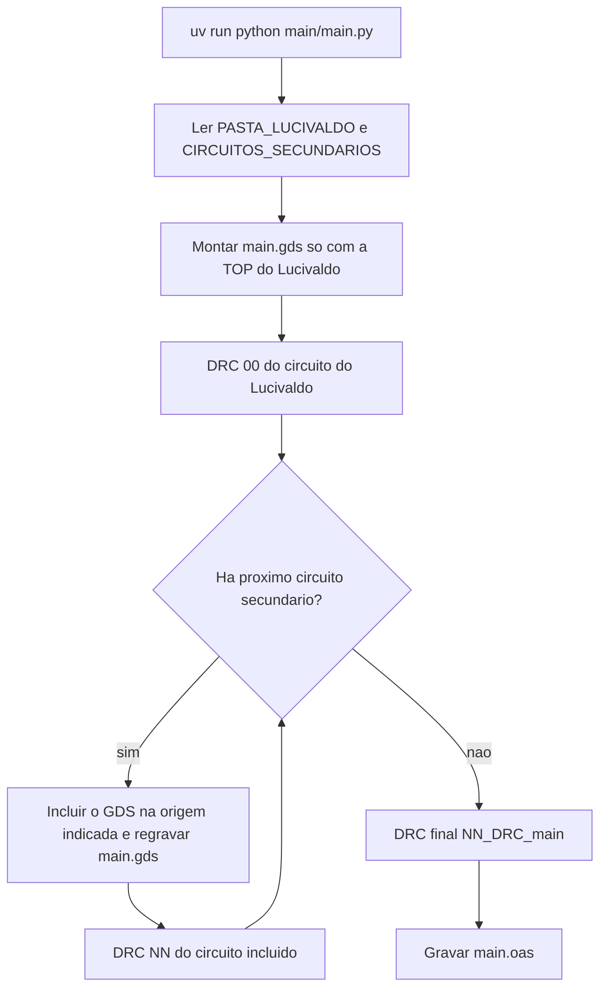

# colab-layout

Repositório de cooperação do time para organizar vários circuitos em um único layout de fabricação na [nanoTOOLS](https://www.appliednt.com/nanosoi/sys/) (Applied Nanotools, processo NanoSOI).

O circuito de base é o do Lucivaldo, em [`circuito-lucivaldo-v2`](circuito-lucivaldo-v2). O layout que vai para a foundry é montado em [`main`](main): o script lê o GDS do Lucivaldo, inclui os circuitos secundários e grava `main.gds` e `main.oas`.

## Prazos desta corrida (Silicon MPW)

Datas da corrida de **novembro de 2026**. Os designs devem ser submetidos até a data final, no horário indicado, para entrar no run.

| Etapa | Data | Horário |
| --- | --- | --- |
| Último dia para solicitar FaML ou janelas through-cladding (Layer 6) | terça-feira, 3 de novembro de 2026 | 18:00 MST |
| Último dia para revisão opcional de layout (draft) | terça-feira, 10 de novembro de 2026 | 18:00 MST |
| Submissão final (layouts DRC-clean) | terça-feira, 24 de novembro de 2026 | 18:00 MST |

Pedidos de customização extra (FaML, Layer 6 etc.) devem ser feitos **duas semanas** antes do prazo final de DRC, conforme as regras da foundry.

## Procedimento geral

1. Cada pessoa faz um **fork** deste repositório.
2. Sobe o próprio layout em uma **pasta separada**, com o GDS do circuito.
3. Passa o circuito pelo **DRC da nanoTOOLS**.
4. Inclui o circuito na lista de [`main/main.py`](main/main.py) e roda o script da main. O GDS do Lucivaldo não é editado.

## Fluxo da main

O script [`main/main.py`](main/main.py) sempre refaz a main do zero:

1. Gera `main/saida/main.gds` a partir da célula `TOP` do circuito do Lucivaldo.
2. Passa esse `main.gds` pelo DRC e grava o relatório `00`.
3. Percorre `CIRCUITOS_SECUNDARIOS`. A cada circuito, inclui o GDS nas coordenadas indicadas, regrava `main.gds` e roda o DRC de novo.
4. No final, o `main.gds` completo passa por um último DRC e o script grava `main/saida/main.oas`.



Os relatórios ficam em `main/relatorios/`, na ordem de execução. O prefixo `00`, `01`, `02`… organiza essa ordem. Cada rodada gera um `.txt` e um `.lyrdb` com o mesmo nome, por exemplo:

- `00_DRC_circuito-lucivaldo-v2.txt`
- `01_DRC_isa-jose-v1.txt`
- `02_DRC_main.txt`

A primeira rodada fixa a baseline de `design_area`, `si_width` e `si_space`. As seguintes não podem piorar essa baseline nem introduzir erro de metal. Avisos (`pin_layer`, `black_box`, `window`) entram no relatório e não interrompem o script. Camada `6/0`, célula com nome repetido, silício `(1, 0)` sobreposto e bloco fora de ±4500 µm interrompem.

## Incluir um circuito secundário

1. Crie uma pasta só para o circuito, no mesmo nível das outras (por exemplo `circuito-fulano-v1`).
2. Deixe o GDS dentro dessa pasta.
3. Em [`main/main.py`](main/main.py), acrescente um item **no fim** de `CIRCUITOS_SECUNDARIOS`:

```python
CIRCUITOS_SECUNDARIOS: list[CircuitoSecundario] = [
    {
        "nome": "isa-jose-v1",
        "gds": "circuito-isa-jose-v1/saida/passivo.gds",
        "celula": "mzi_o4_passivo",
        "origem_um": (2300.0, -4400.0),
    },
    {
        "nome": "fulano-v1",
        "gds": "circuito-fulano-v1/circuito.gds",
        "celula": "TOP",
        "origem_um": (0.0, 0.0),
    },
]
```

- `nome` aparece no relatório (`01_DRC_fulano-v1`).
- `gds` é o caminho do arquivo a partir da raiz do repositório.
- `celula` é a célula desse GDS que entra na main.
- `origem_um` é o ponto `(x, y)`, em µm, onde o circuito é colocado.

4. Na raiz do repositório, rode de novo:

```powershell
uv run python main/main.py
```

O script inclui todos os circuitos da lista, repete o DRC depois de cada um, atualiza `main.gds` e, no final, atualiza `main.oas`.

## Atualizar a pasta do Lucivaldo

O circuito de base não entra na lista de secundários. O caminho da pasta fica numa variável no topo de [`main/main.py`](main/main.py):

```python
PASTA_LUCIVALDO = "circuito-lucivaldo-v2"
GDS_LUCIVALDO = "CircuitoLucivaldoV2.gds"
```

Se o Lucivaldo renomear a pasta ou o GDS, atualize essas duas variáveis. A célula lida continua sendo `TOP`.

Para recompilar o GDS do Lucivaldo a partir do notebook:

```powershell
uv run python circuito-lucivaldo-v2/compile.py
```

O arquivo sai em `circuito-lucivaldo-v2/CircuitoLucivaldoV2.gds`. Depois rode `main/main.py` para remontar a main.

## Ambiente

O ambiente Python é único, na raiz do repositório. Não crie um `venv` dentro da pasta de um circuito.

É preciso ter o [KLayout](https://www.klayout.de/) instalado. O script procura `klayout_app.exe` no `PATH`, em `%USERPROFILE%\KLayout`, em `Program Files` e em `%APPDATA%\KLayout`.

```powershell
uv sync
uv run python main/main.py
```

`uv sync` cria o `.venv` da raiz e instala as bibliotecas do layout (gdsfactory, PhotonForge e o que os circuitos importam).

## PDK

A versão atual do PDK é a **Version 8.0**. O arquivo está com José Roberto.

Quem ainda não tiver o PDK pode solicitar por e-mail: [jose.arcanjo@ee.ufcg.edu.br](mailto:jose.arcanjo@ee.ufcg.edu.br).

O DRC da main usa o deck NanoSOI Silicon v10 em [`main/drc/NanoSOI_Silicon_v10.drc`](main/drc/NanoSOI_Silicon_v10.drc).

## Regras gerais de layout

- As **grades de entrada e saída** devem estar direcionadas para **lados opostos**:

  

- **Sugestão adicional:** as grades devem estar **desalinhadas em x** (não ficar na mesma coordenada horizontal).
